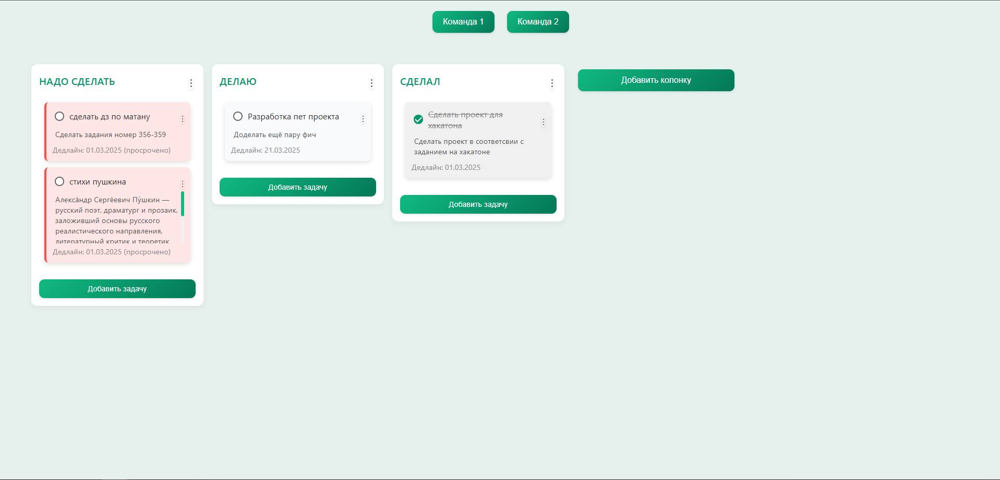
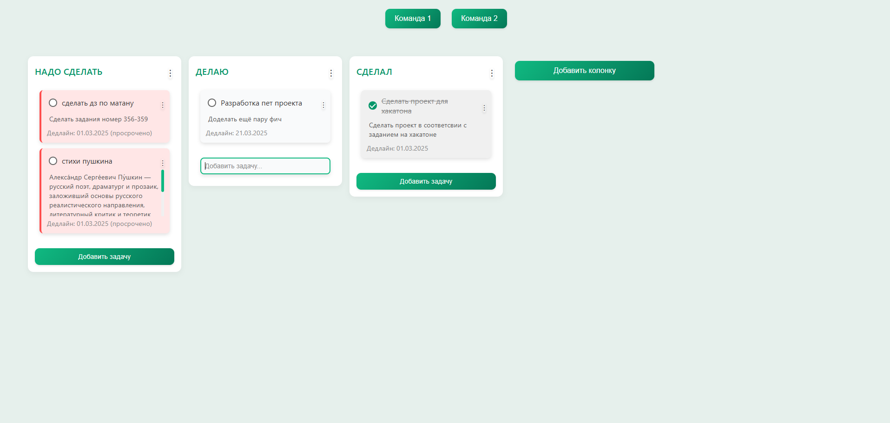
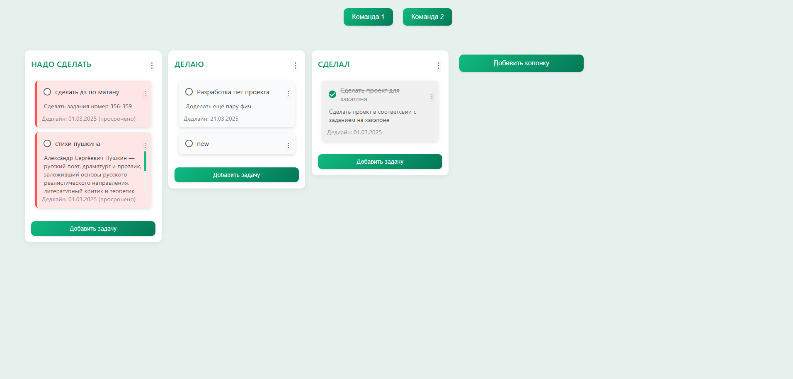
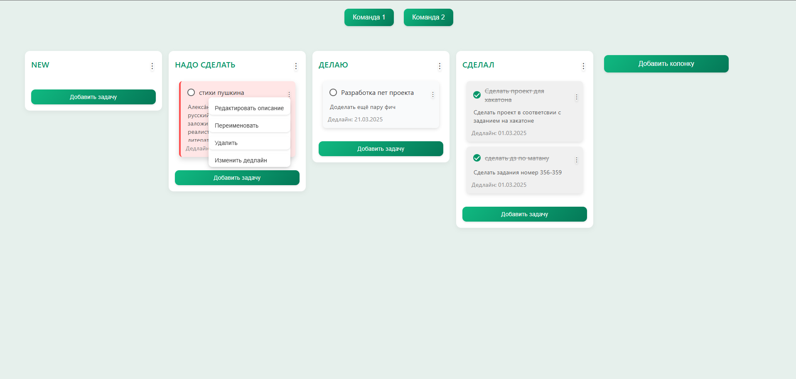
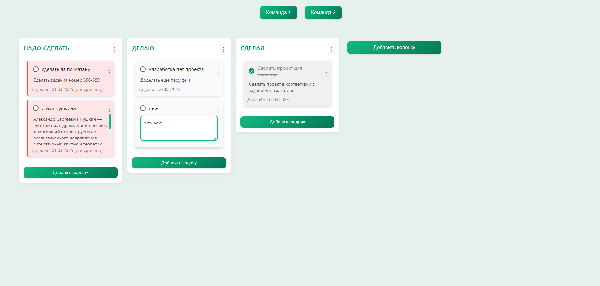
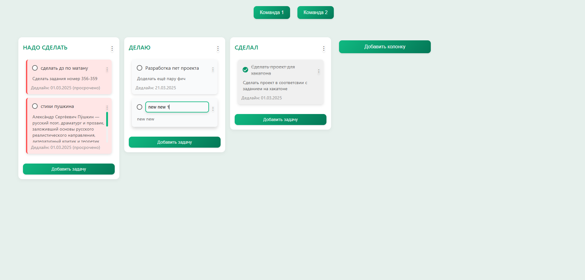
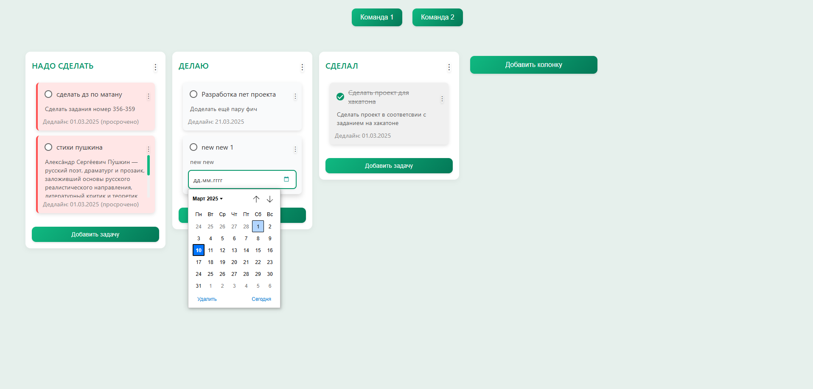

# Task Manager Frontend
*Простое и удобное веб-приложение для управления задачами в стиле Kanban-доски.*

---

## О проекте

Task Manager Frontend — это клиентская часть приложения для управления задачами. Оно представляет собой интерактивную Kanban-доску, где вы можете создавать колонки, добавлять задачи, перемещать их с помощью drag-and-drop, отмечать как выполненные и многое другое. Проект написан с использованием HTML, CSS и JavaScript, без внешних фреймворков, что делает его лёгким и быстрым.

Этот репозиторий содержит только фронтенд. Бэкенд планируется добавить позже в отдельной папке или репозитории.

---

## Особенности

- Создание и удаление колонок.
- Добавление, редактирование и удаление задач.
- Drag-and-drop для перемещения колонок и задач.
- Отметка задач как выполненных с помощью чекбоксов.
- Поддержка описаний задач, сроков выполнения и визуальных индикаторов просрочки.
- Адаптивный дизайн (в процессе доработки).
- Локальное сохранение данных (в планах).

---

## Скриншоты

Вот как выглядит интерфейс приложения:

### Главная доска
  
*Общий вид Kanban-доски с колонками и задачами.*

### Добавление задачи
  
*Форма добавления новой задачи в колонку.*

*Новая задача в колонке.*

### Перетаскивание задачи
  
*Пример перетаскивания задачи между колонками.*

  
*Пример перетаскивания задачи между колонками.*
---

### Перетаскивание колонки с задачами
  
*Пример перетаскивания колонки.*

  
*Пример перетаскивания колонки.*
---

### Контекстное меню для задач и колонок
  
*Контекстное меню задачи.*

  
*Добавление описания задачи.*

  
*Добавление описания задачи.*

  
*Добавление дедалайна задачи.*

---
## Установка и запуск

### Требования
- Веб-браузер (Chrome, Firefox, Edge и т.д.).
- Локальный сервер (опционально, например, Live Server в VS Code).

### Инструкции
1. Склонируйте репозиторий:
   ```bash
   git clone https://github.com/4rscode/taskManagerFront.git
