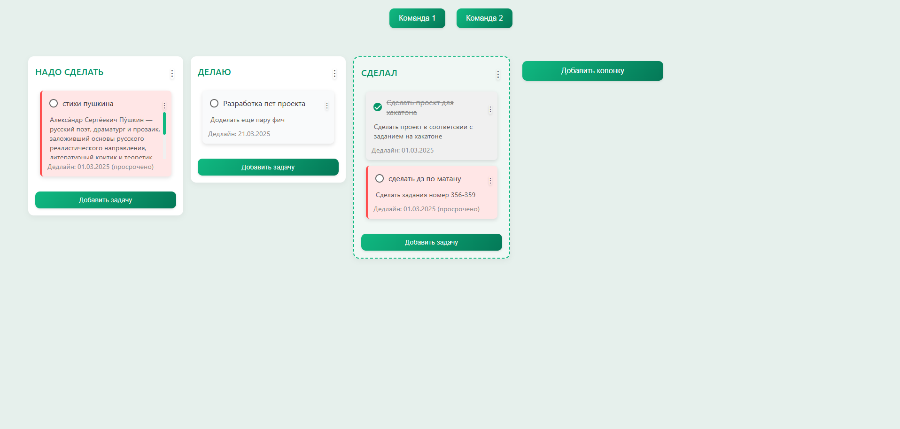
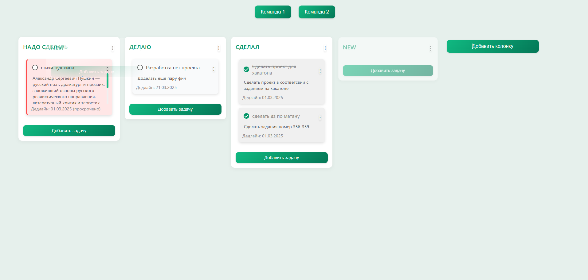
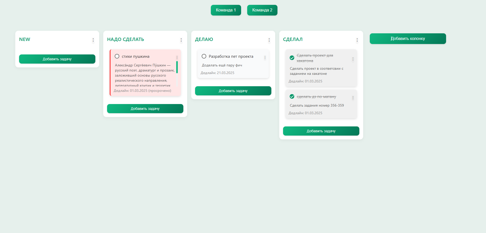
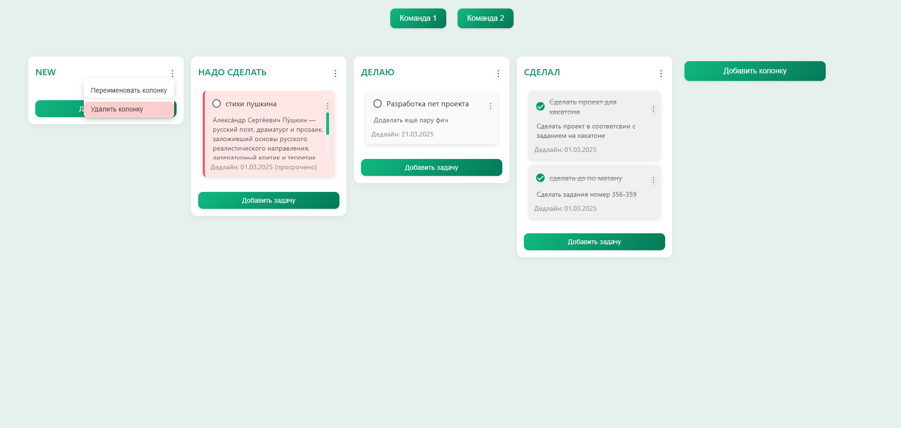

# Task Manager Frontend
*Простое и удобное веб-приложение для управления задачами в стиле Kanban-доски.*

---

## О проекте

Task Manager Frontend — это клиентская часть приложения для управления задачами. Оно представляет собой интерактивную Kanban-доску, где вы можете создавать колонки, добавлять задачи, перемещать их с помощью drag-and-drop, отмечать как выполненные и многое другое. Проект написан с использованием HTML, CSS и JavaScript, без внешних фреймворков, что делает его лёгким и быстрым.

Этот репозиторий содержит только фронтенд. Бэкенд планируется добавить позже в отдельной папке или репозитории.

---

## Особенности

- Создание и удаление колонок.
- Добавление, редактирование и удаление задач.
- Drag-and-drop для перемещения колонок и задач.
- Отметка задач как выполненных с помощью чекбоксов.
- Поддержка описаний задач, сроков выполнения и визуальных индикаторов просрочки.
- Адаптивный дизайн (в процессе доработки).
- Локальное сохранение данных (в планах).

---

## Скриншоты

Вот как выглядит интерфейс приложения:

### Главная доска

  
*Общий вид Kanban-доски с колонками и задачами.*

### Добавление задачи

  
*Форма добавления новой задачи в колонку.*


*Новая задача в колонке.*

### Перетаскивание задачи

  
*Пример перетаскивания задачи между колонками.*

  
*Пример перетаскивания задачи между колонками.*

---

### Перетаскивание колонки с задачами

  
*Пример перетаскивания колонки.*

  
*Пример перетаскивания колонки.*

---

### Контекстное меню для задач и колонок
  
*Контекстное меню задачи.*

  
*Добавление описания задачи.*

  
*Добавление описания задачи.*

  
*Добавление дедалайна задачи.*

  
*Контекстное меню колонки.*

---
## Установка и запуск

### Требования
- Веб-браузер (Chrome, Firefox, Edge и т.д.).
- Локальный сервер (опционально, например, Live Server в VS Code).

### Инструкции
1. Склонируйте репозиторий:
   ```bash
   git clone https://github.com/4rscode/taskManagerFront.git

2. Перейдите в папку проекта:
   ```bash
   cd taskManagerFront

3. Откройте index.html в браузере:
   ```bash
   npx live-server

 ### Использование
 Самое главное для работы бэкенда нужно запустить сервер бэкенда который лежит в репозитории https://github.com/4rscode/taskManagerBackend
 1. Откройте приложение в браузере.
 2. Нажмите кнопку "Добавить колонку" и введите название.
 3. В колонке нажмите "Добавить задачу", чтобы создать задачу.
 4. Перетаскивайте задачи и колонки для изменения порядка.
 5. Отмечайте задачи как выполненные с помощью чекбоксов.

### Планы на будущее

1.Улучшить адаптивность для мобильных устройств.
2.Добавить возможность прикреплять изображения и комментарии.
